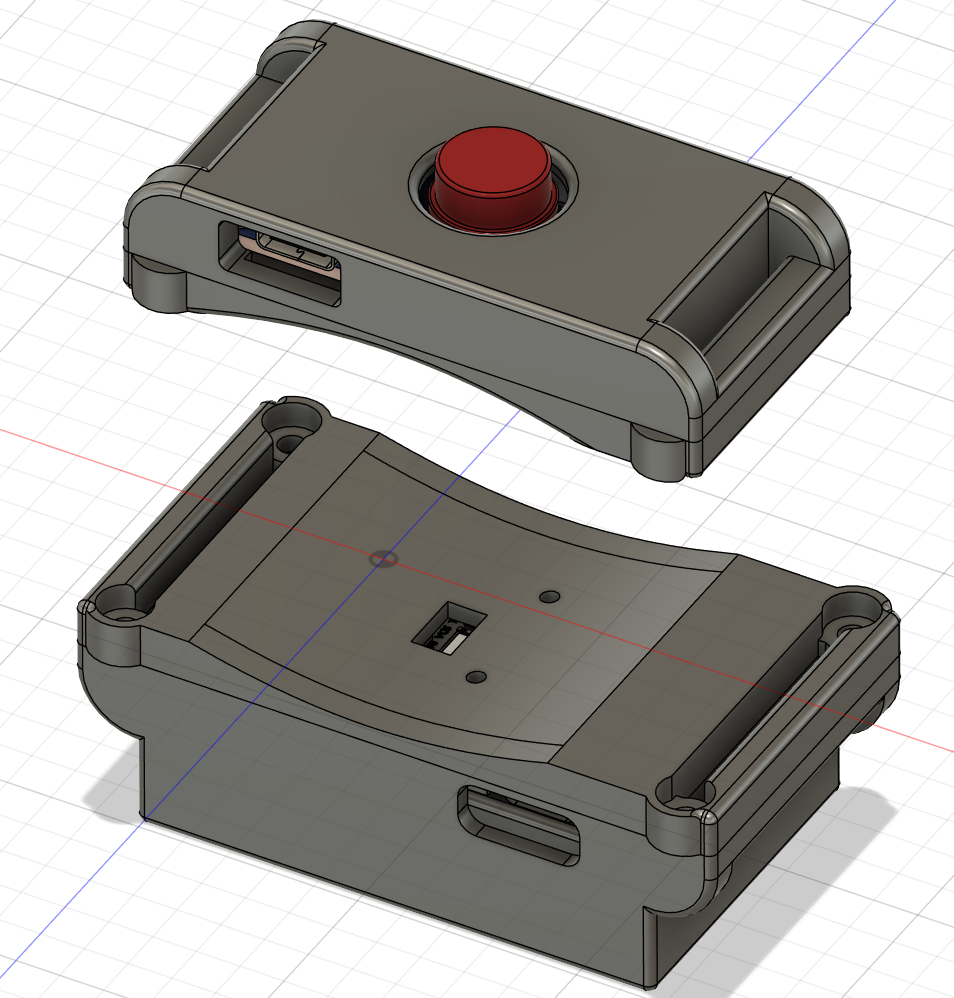
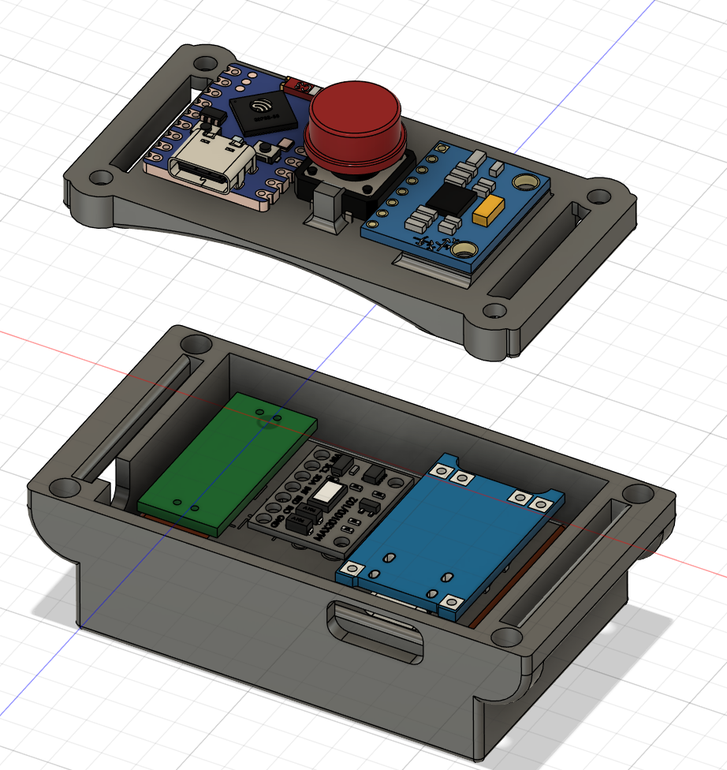
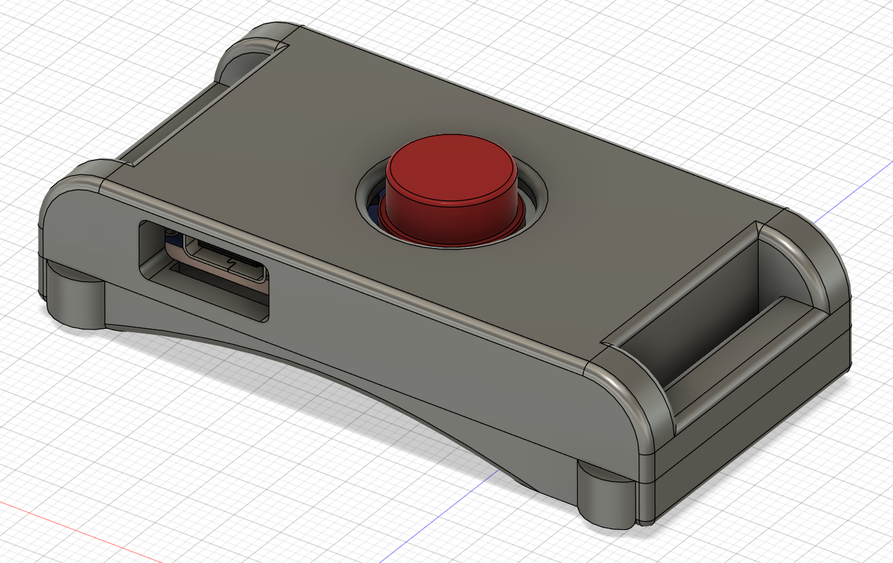
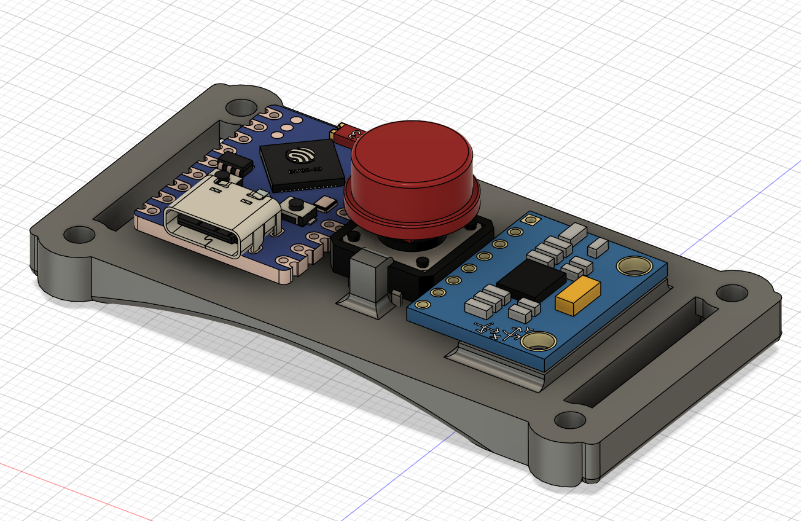
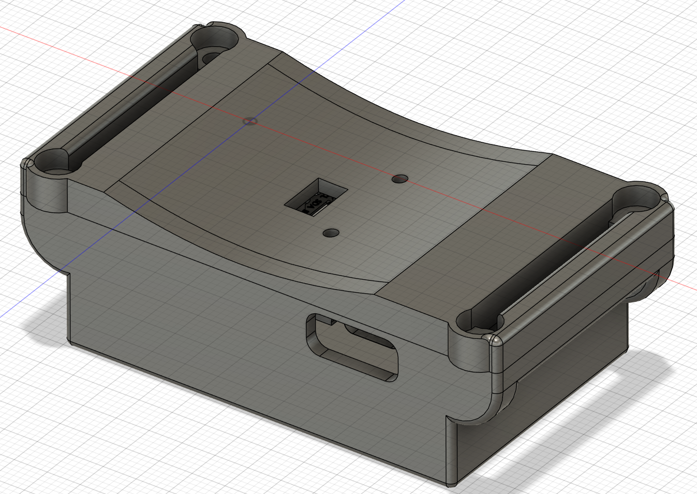
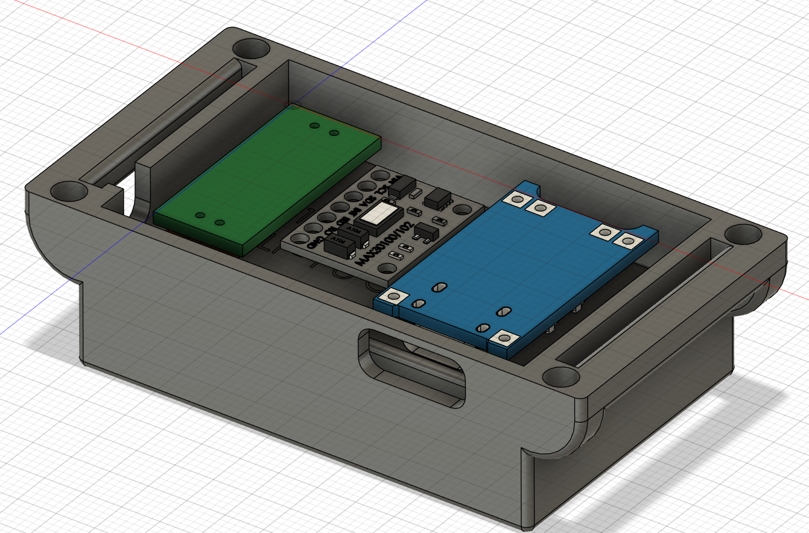
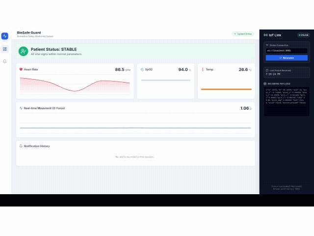
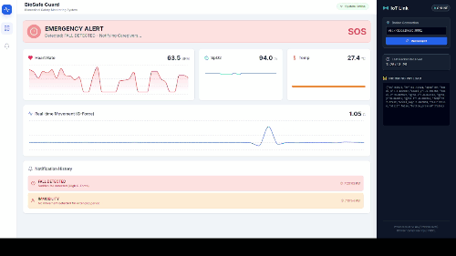
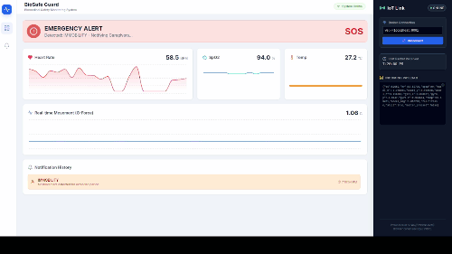
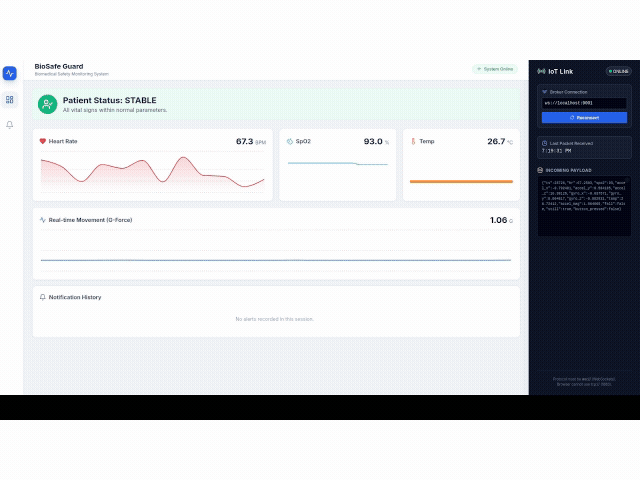

# BioSafe: Giyilebilir Sensörlü Çok Disiplinli Tasarım Projesi

Bu proje, **Yıldız Teknik Üniversitesi Elektrik-Elektronik Fakültesi** mühendislik öğrencileri tarafından geliştirilen **Çok Disiplinli Tasarım Projesi** dersinin bir ürünüdür.

BioSafe, yaşamsal verileri ve hareket analizlerini gerçek zamanlı izleyen, acil durumlarda uyarı veren, **ESP32-S3 ZERO** tabanlı kompakt bir giyilebilir teknolojidir.

## İstatistikler


## 🌟 Proje Özellikleri

BioSafe, donanım üzerindeki sensörler ve akıllı algoritmalar sayesinde aşağıdaki verileri **canlı olarak** web arayüzüne aktarır:

  - ❤️ **Nabız (BPM)**

  - 🩸 **Kandaki Oksijen Oranı (SpO2)**

  - 🌡️ **Vücut Sıcaklığı**

  - 📉 **G-Kuvveti (İvme)**

### 🚨 Alarm ve Güvenlik Durumları

Sistem, kullanıcı güvenliğini sağlamak için 4 farklı alarm mekanizmasına sahiptir:

1.  **Düşme Tespiti:** Belirlenen G-kuvveti eşiği aşıldığında (Ani darbe/düşme) otomatik uyarı gönderir.

2.  **Anormal Nabız:** Nabız, belirlenen alt ve üst limitlerin dışına çıktığında uyarı verir.

3.  **Hareketsizlik Uyarısı:** Belirli bir süre (örn. 10 sn) hareket algılanmadığında kullanıcıyı uyarır.

4.  **Acil Durum Butonu:** Cihaz üzerindeki butona basıldığında manuel olarak acil durum sinyali gönderir.

### ⚙️ Uzaktan Yapılandırılabilir Ayarlar

Web arayüzü üzerinden cihazın çalışma parametreleri dinamik olarak ayarlanabilir. Varsayılan ayarlar aşağıda belirtilmiştir:

  - Nabız Alt ve Üst Limitleri (Varsayılan: **Min 40 BPM, Max 120 BPM**)

  - Düşme Tespiti Hassasiyeti (Min G Miktarı) (Varsayılan: **2 G**)

  - Hareketsizlik Süresi Eşiği (Varsayılan: **10 Saniye**)

  - Sensör Okuma Frekansı (Enerji verimliliği için) (Varsayılan: **1 Hz**)

-----

## 🛠️ Donanım Özellikleri

Proje, taşınabilirlik ve konfor ön planda tutularak tasarlanmıştır:

  - **Mikrodenetleyici:** ESP32-S3 ZERO (Küçük boyut ve yüksek işlem gücü için tercih edilmiştir).

  - **Sensörler:**

      - **MPU6050:** İvme ve jiroskop (Hareket ve düşme tespiti).

      - **MAX30100:** Nabız ve oksijen satürasyonu.

  - **Batarya:** 1800 mAh Li-Po Batarya (Uzun süreli kullanım).

  - **Tasarım:** Bileğe tam uyum sağlayan, 3D yazıcı ile üretilmiş özel kutu tasarımı. İki adet cırt cırt bant ile ergonomik kullanım.

  - **Ekstra:** Acil durum fiziksel butonu.

### 📐 3D Tasarım ve Montaj Detayları

Cihazın dış kasası, elektronik bileşenleri (ESP32, MPU6050, MAX30100) korumak ve bileğe ergonomik uyum sağlamak amacıyla özel olarak modellenmiştir.

| Genel Montaj Görünümü | İç Donanım Yerleşimi |
| :---: | :---: |
|  |  |
| **Kompakt Tasarım ve Acil Durum Butonu** | **Sensör ve Batarya Yerleşimi** |

#### Parça Detayları

| Üst Kapak (Dış) | Üst Kapak (İç) |
| :---: | :---: |
|  |  |
| USB Portu ve Buton Yuvası | ESP32 ve Buton Montajı |

| Alt Kasa (Dış) | Alt Kasa (İç) |
| :---: | :---: |
|  |  |
| Bilek Temas Yüzeyi ve Sensör Penceresi | Batarya ve Sensör Yuvası |

## Kurulum

Proje, gömülü sistem (ESP32) ve web arayüzü olmak üzere iki ana bileşenden oluşmaktadır.

Öncelikle projenin tüm kaynak kodunu klonlayın:

Bash

```
git clone https://github.com/mertColpan/Cok_disiplinli_Tasar-m_Projesi.git
cd Cok_disiplinli_Tasar-m_Projesi
```

-----

## 🛠️ I. Gömülü Kart (ESP32) Kurulumu

Bu bölüm, sensör verilerini toplayıp **MQTT** aracılığıyla sunucuya gönderen ESP32 kartının kurulumunu kapsar.

### 1\. Arduino IDE ve Geliştirici Modül Ayarları

1.  **Arduino IDE**'yi açın.

2.  `Dosya` -\> `Aç` yoluyla `ESP32_wearable_sensor_with_MQTT/ESP32_wearable_sensor_with_MQTT.ino` dosyasını açın.

3.  **ESP32 Geliştirici Modülünü İndirme:**

      - `Tools` -\> `Board` -\> `Boards Manager...` kısmından **`ESP32`** geliştirici modülünü aratın ve indirin.

4.  **Kart Seçimi:**

      - `Tools` -\> `Board` -\> `ESP32 Arduino` altından bu proje için kullanılan kartı, örneğin **`ESP32S3 Dev Module`**'ü seçin. (Kullandığınız donanıma göre farklı bir ESP32 kartı seçmeniz gerekebilir.)

5.  **Port Seçimi:**

      - ESP32 kartınızı bilgisayarınıza bağlayın.

      - `Tools` -\> `Port` kısmından karta bağlı olan **USB (Genellikle `USB* ACM*`)** portunu seçin.

### 2\. Gerekli Kütüphaneleri İndirme

Aşağıdaki kütüphaneleri indirmek için `Sketch` -\> `Include Libraries` -\> `Manage libraries...` kısmını kullanın:

  - `WiFi` (Dahili)

  - `PubSubClient` (MQTT İstemcisi)

  - `ArduinoJson`

  - `Wire`

  - `MAX30100_PulseOximeter` (Nabız Sensörü için gerekli kütüphane)

  - `Adafruit MPU6050` (İvme Ölçer için gerekli kütüphane)

  - `Adafruit Sensor`

### 3\. Konfigrasyon Bilgilerini Düzenleme

`ESP32_wearable_sensor_with_MQTT.ino` dosyası içinde aşağıdaki değişkenleri kendi ağ ve donanım bilgilerinize göre güncelleyin:

C++

```
const char* ssid = "<wifi_ssid>";           // Bağlanılacak Wi-Fi ağ adı
const char* password = "<wifi password>";   // Wi-Fi şifresi
const char* mqtt_server = "<MQTT_server_ip>"; // MQTT Broker IP adresi

#define I2C_SDA_PIN <your_sda_pin>         // I2C Veri Pini (Örn: 8)
#define I2C_SCL_PIN <your_scl_pin>         // I2C Saat Pini (Örn: 9)
#define BUTTON_SIGNAL_PIN <your_button_signal_pin> // Buton Sinyal Pini
#define BUTTON_GND_PIN <your_buton_gnd_pin>        // Buton GND Pini
```

> **Not:** Köşeli parantez (`< >`) içindeki bilgileri donanımınıza ve ağ ayarlarınıza göre mutlaka doldurun.

### 4\. Kodu Yükleme

Tüm aşamalar tamamlandığında, kodu kablo aracılığıyla gömülü karta **`Upload`** butonu ile aktarabilirsiniz.

-----

## II. Web Arayüzü Kurulumu (biosafe-app)

Bu arayüz, ESP32 kartından MQTT ile gelen yaşamsal verileri görselleştirir ve acil durumları bildirir.

**Gereksinim:** Node.js ve npm'in sisteminizde kurulu olduğundan emin olun.

1.  Web uygulaması dizinine gidin:

    ```
    cd biosafe-app
    ```

2.  Gerekli tüm bağımlılıkları yükleyin:

    ```
    npm install
    ```

3.  Uygulamayı geliştirme modunda başlatın:

    ```
    npm run dev
    ```

Başarılı bir kurulumun ardından web arayüzü genellikle `http://localhost:3000` (veya konsolda belirtilen port) adresinde erişilebilir olacaktır.

### 🖥️ Arayüz Tanıtımı ve Alarm Senaryoları

Sistem çalıştığında, web arayüzü canlı verileri göstermeye başlar. Aşağıda, BioSafe'in farklı acil durumlarda nasıl tepki verdiğini gösteren senaryolar yer almaktadır:



#### 1\. Acil Durum Butonu (Manuel Alarm)

Kullanıcı cihaz üzerindeki fiziksel butona bastığında, arayüz anında görsel ve yazılı bir acil durum uyarısı verir.



#### 2\. Düşme Tespiti

Cihaz, belirlenen G-kuvveti eşiğini (Varsayılan: 2G) aşan ani bir darbe veya düşme algıladığında düşme alarmı tetiklenir.



#### 3\. Anormal Nabız Uyarısı

Kullanıcının nabzı, ayarlanan güvenli aralığın (Varsayılan: 40-120 BPM) dışına çıktığında sistem kritik sağlık uyarısı verir.

#### 4\. Hareketsizlik Uyarısı

Belirlenen süre boyunca (Varsayılan: 10 saniye) kullanıcıdan herhangi bir hareket verisi alınamazsa, hareketsizlik alarmı devreye girer.

